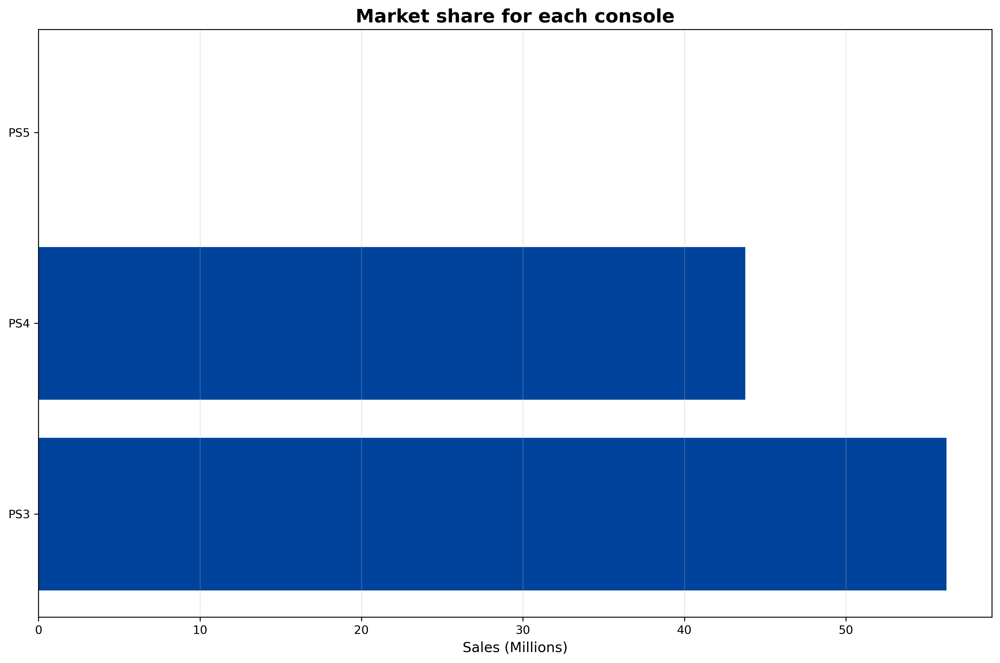
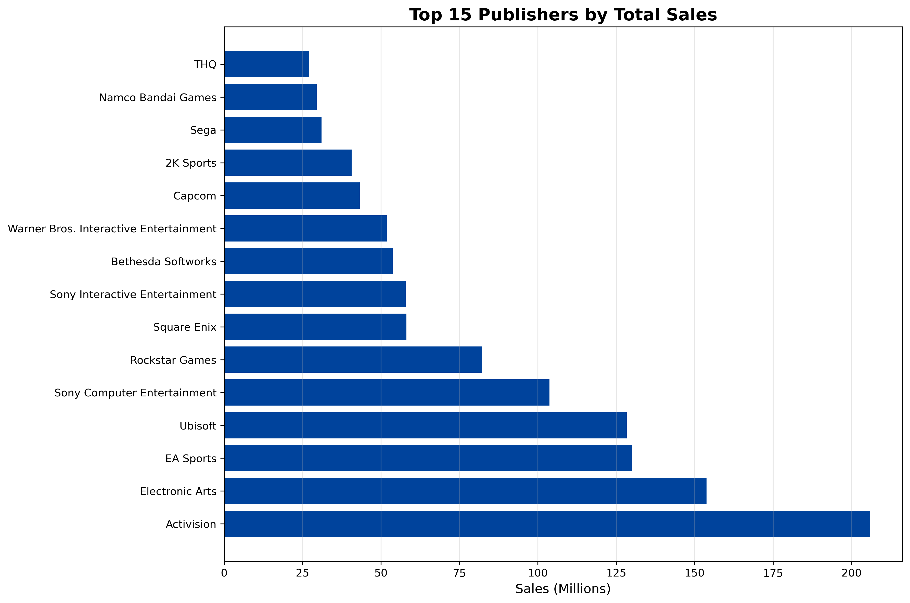
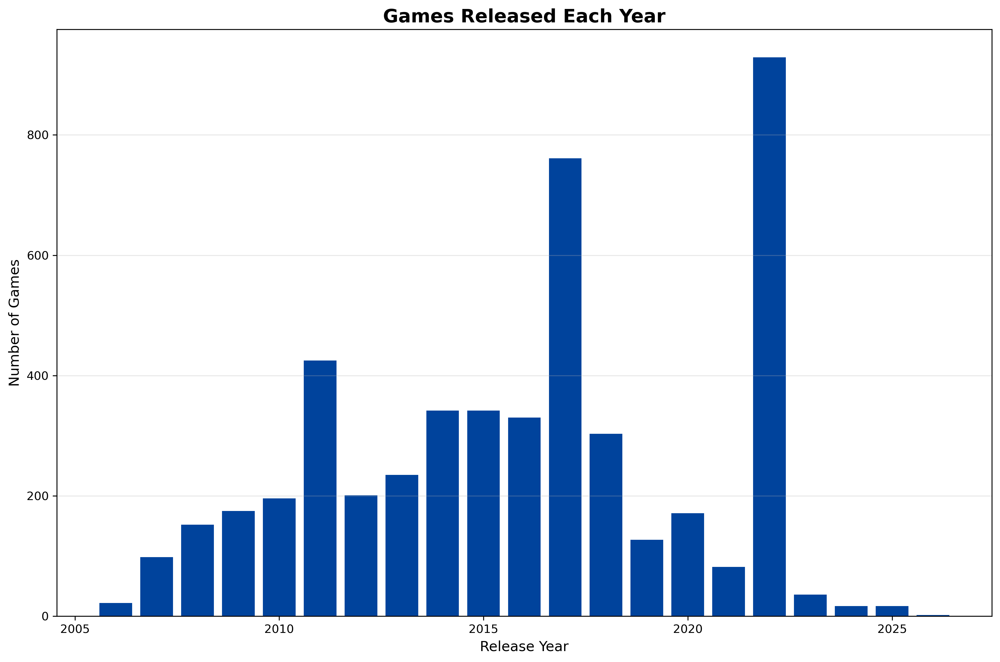
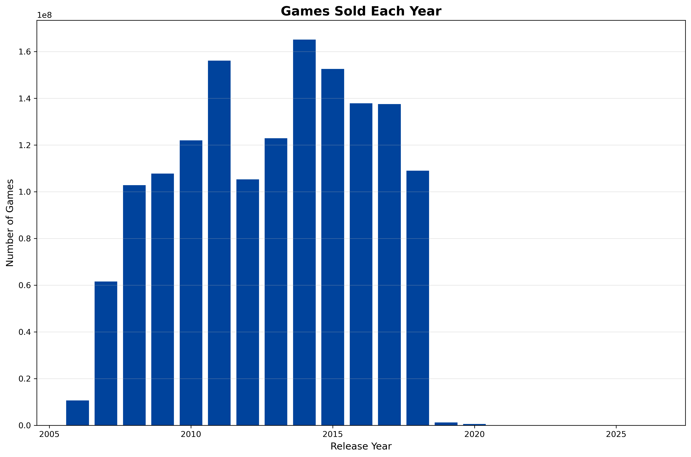
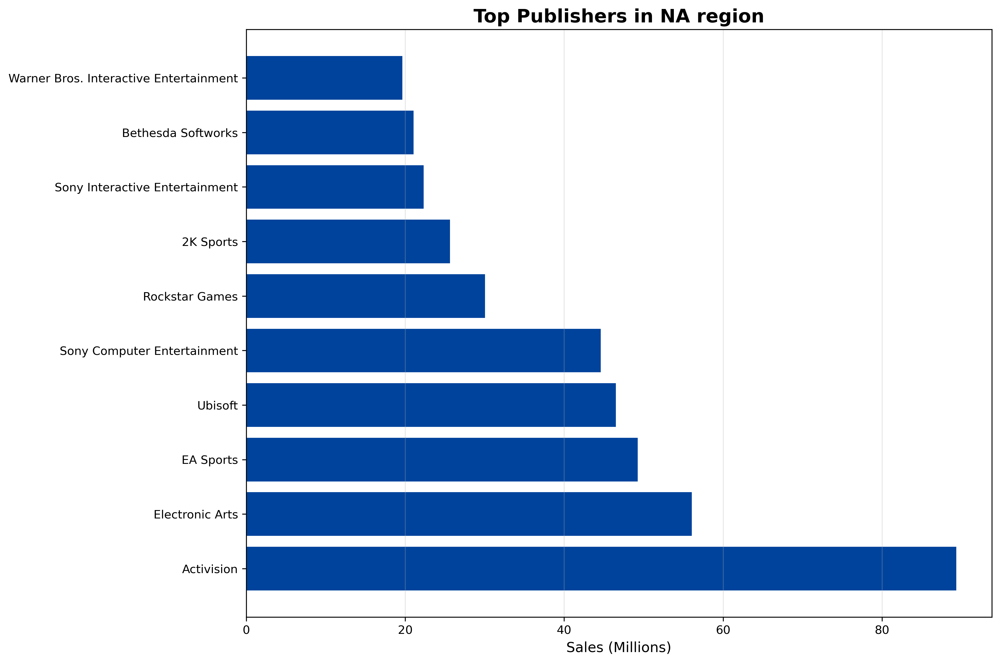

# PlayStation Sales Data Pipeline

End-to-end ETL pipeline analyzing 4,963 PlayStation games across PS3, PS4, and PS5 platforms with regional sales breakdown.

---

## Project Scope

This project demonstrates a complete data engineering workflow:

**LOAD → EXPLORE → CLEAN → TRANSFORM → ANALYZE → VISUALIZE**

The pipeline processes raw gaming sales data, handles missing values intelligently, and generates business insights through SQL analysis.

**Dataset**: 4,963 PlayStation games (2006-2026)  
**Source**: Kaggle - PlayStation Sales and Metadata  
**Coverage**: Global sales across North America, Europe (PAL), Japan, and Other regions

---

## Tech Stack

- **Python 3.11** - Core programming language
- **Pandas** - Data manipulation and cleaning
- **SQLite** - Database management and SQL queries
- **Matplotlib** - Data visualization
- **Jupyter Notebook** - Development environment

---

## Project Structure

```
Playstation_work/
├── data/
│   ├── raw/                    # Original dataset
│   └── processed/              # Cleaned data output
├── outputs/                    # Generated visualizations
├── sql/                        # All 35 SQL queries
├── database/                   # SQLite database
├── playstation_analysis.ipynb  # Main pipeline notebook
├── README.md
├── requirements.txt
└── .gitignore
```

---

## Pipeline Overview

### 1. LOAD

- Import CSV data (4,963 rows × 18 columns)
- Initial data type validation
- Create comparison dataframe for quality reporting

### 2. EXPLORE

- Analyze data distribution
- Identify missing values (69% in metacritic, 43% in genres/ratings)
- Check for duplicates (0 found)

### 3. CLEAN

- Convert date columns to datetime format
- Extract year and month features
- Handle missing values:
  - **Numeric columns**: Median imputation grouped by Console
  - **Categorical columns**: Mode imputation grouped by Publisher and Developer
- **Result**: 0% missing values, 100% of rows preserved

### 4. TRANSFORM

- Delete redundant date columns (kept year/month features)
- Create SQLite database
- Load cleaned data into database table
- Verify data integrity

### 5. ANALYZE

- Execute 35 SQL queries across 4 complexity tiers
- Extract business insights on:
  - Console performance
  - Publisher market share
  - Regional sales patterns
  - Game lifecycle trends

### 6. VISUALIZE

- Generate 6 key visualizations
- Export charts for presentation

---

## Key Findings

### Console Analysis

- **PS4** has the largest game library with 1,991 titles (40% of total games)
- **PS3** leads in total sales with 839M units (56% market share)
- **PS5** shows limited historical data due to recent release (2020+)

### Regional Market Breakdown

| Region        | Percentage | Sales Volume |
| ------------- | ---------- | ------------ |
| North America | 39.2%      | 584.7M units |
| Europe (PAL)  | 38.9%      | 581.0M units |
| Japan         | 7.2%       | 108.1M units |
| Other         | 14.7%      | 219.5M units |

North America and Europe dominate the market with nearly equal share, while Japan represents a smaller but significant market segment.

### Top Publishers by Total Sales

1. Activision - 206M (Call of Duty franchise dominance)
2. Electronic Arts - 154M
3. EA Sports - 130M (FIFA series)
4. Ubisoft - 128M
5. Sony Computer Entertainment - 104M

### Best-Selling Games

1. Grand Theft Auto V (PS3) - 20.3M copies
2. Grand Theft Auto V (PS4) - 19.4M copies
3. Call of Duty: Black Ops 3 (PS4) - 15.1M copies

GTA V appears twice in the top 3, demonstrating exceptional cross-platform performance.

---

## SQL Analysis

The project includes 35 SQL queries organized by complexity:

### Query Distribution

- **Tier 1 (Basic)**: 12 queries - Simple aggregations, GROUP BY, ORDER BY
- **Tier 2 (Intermediate)**: 13 queries - Subqueries, CTEs, market share calculations
- **Tier 3 (Advanced)**: 5 queries - Multi-dimensional analysis, time-series
- **Tier 4 (Expert)**: 5 queries - Window functions (ROW_NUMBER, PARTITION BY, RANK)

All queries are documented in [sql/queries.sql](sql/queries.sql)

---

## Visualizations

### Console Market Share



PS3 holds 56% of total sales, while PS4 accounts for 44%. PS5 data is not yet significant due to the dataset's timeframe.

### Top 15 Publishers by Sales



Activision leads the market, followed by EA and EA Sports. The top 5 publishers represent a significant portion of total market sales.

### Games Released Per Year



Peak release year was 2022 with 929 games. The data shows declining releases in 2024-2026 due to incomplete PS5 sales data.

### Sales Per Year



Peak sales year was 2014 with 165M units sold. Sales declined after 2018, coinciding with the PS4 lifecycle maturity.

### Top Publishers in North America



Activision dominates the NA market with 15.3% market share (89.3M sales), significantly ahead of competitors.

[View all visualizations](outputs/)

---

## Data Quality Report

### Before Cleaning

```
Total rows: 4,963
Missing values:
  - metacritic: 3,433 (69.17%)
  - genres: 2,160 (43.52%)
  - rating: 2,116 (42.64%)
  - platforms: 2,116 (42.64%)
  - Release Date: 1,437 (28.95%)
Duplicates: 0
```

### After Cleaning

```
Total rows: 4,963 (100% preserved)
Missing values: 0 (0%)
Duplicates: 0

Cleaning approach:
- Numeric features: Median imputation grouped by Console
- Categorical features: Mode imputation grouped by Publisher/Developer
- Fallback: Global median/mode for remaining nulls
```

**Result**: Successfully cleaned the dataset without losing any records, maintaining data integrity throughout the pipeline.

---

## How to Run

### Prerequisites

```bash
Python 3.8 or higher
```

### Installation

```bash
# Clone the repository
git clone https://github.com/CalinP1/Playstation_work.git
cd Playstation_work

# Install required packages
pip install -r requirements.txt

# Launch Jupyter Notebook
jupyter notebook playstation_analysis.ipynb
```

### Running the Pipeline

1. Open `playstation_analysis.ipynb`
2. Execute cells sequentially from top to bottom
3. Pipeline will:
   - Load raw data from `data/raw/`
   - Clean and transform data
   - Create SQLite database in `database/`
   - Generate visualizations in `outputs/`
   - Save cleaned data to `data/processed/`

Expected runtime: 2-3 minutes on standard hardware

---

## Technical Implementation

### Data Cleaning Strategy

The cleaning process used intelligent imputation rather than dropping rows:

```python
# Numeric columns - grouped median
numeric_columns = ["Release Year", "Release Month", "rating", "ratings_count", "metacritic"]
for col in numeric_columns:
    df[col] = df.groupby("Console")[col].transform(lambda x: x.fillna(x.median()))

# Categorical columns - grouped mode
def set_missing_values_to_mode(df, column, group):
    result = df.groupby(group)[column].transform(
        lambda x: x.fillna(x.mode()[0]) if not x.mode().empty else x
    )
    # Fallback to global mode if group mode doesn't exist
    if not df[column].mode().empty:
        result = result.fillna(df[column].mode()[0])
    return result

df["platforms"] = set_missing_values_to_mode(df, "platforms", ["Publisher", "Developer"])
df["genres"] = set_missing_values_to_mode(df, "genres", ["Publisher", "Developer"])
```

This approach preserves data relationships and maintains statistical integrity.

---

## Challenges and Solutions

### Challenge 1: High Missing Data Rate

**Problem**: 69% of metacritic scores missing, 43% of genres missing

**Solution**: Implemented grouped imputation strategy:

- Group by Console for numeric data (games on same console have similar patterns)
- Group by Publisher/Developer for categorical data (publishers maintain consistent genre focus)
- Fallback to global median/mode when group-level imputation isn't possible

**Result**: Retained all 4,963 records while maintaining data quality

### Challenge 2: PS5 Data Sparsity

**Problem**: PS5 sales data shows mostly zeros due to recent console release

**Solution**:

- Acknowledged limitation in analysis
- Focused insights on PS3/PS4 with substantial historical data
- Flagged PS5 queries as incomplete in documentation

### Challenge 3: Date Feature Engineering

**Problem**: Release Date stored as object type, limiting temporal analysis

**Solution**:

```python
df["Release Date"] = pd.to_datetime(df['Release Date'], errors='coerce')
df["Release Year"] = df["Release Date"].dt.year.astype('Int64')
df["Release Month"] = df["Release Date"].dt.month.astype('Int64')
```

Created separate year/month features for easier querying and analysis.

---

## Future Enhancements

- **Cloud Deployment**: Migrate pipeline to AWS/Azure for scalability
- **Orchestration**: Implement Apache Airflow for scheduled pipeline runs
- **Real-time Ingestion**: Add streaming data ingestion for new releases
- **Interactive Dashboard**: Build Tableau/PowerBI dashboard for business users
- **Predictive Modeling**: Apply ML models to forecast game sales
- **API Integration**: Pull live data from PlayStation Network API
- **Data Warehouse**: Design star schema for analytics optimization

---

## Lessons Learned

### Data Engineering

- Missing data doesn't always require row deletion - smart imputation can preserve valuable records
- Grouped imputation maintains data relationships better than global imputation
- Feature engineering (year/month extraction) simplifies downstream analysis
- Logging is essential for debugging and monitoring pipeline execution

### SQL Analysis

- Window functions (PARTITION BY) enable complex ranking without subqueries
- CTEs improve query readability but aren't always necessary
- Market share calculations require careful subquery handling
- Query complexity should match the business question - don't over-engineer

### Project Management

- Organizing queries by complexity tier helps demonstrate skill progression
- Clear folder structure makes projects more professional and maintainable
- Documentation takes time but significantly improves project value
- Version control from day one prevents headaches later

---

## About

This project was built as a portfolio piece to demonstrate data engineering capabilities including:

- ETL pipeline design
- Data cleaning and transformation
- SQL query optimization
- Data visualization
- Technical documentation

The goal was to showcase end-to-end data engineering skills on a real-world dataset with actual business applications.

---

## Author

**Calin**

Aspiring Data Engineer with background in CAE engineering, transitioning to data engineering through hands-on projects and continuous learning.

- GitHub: [@CalinP1](https://github.com/CalinP1)
- LinkedIn: [Connect with me]
- Portfolio: [Additional projects]

---

## License

This project is open source and available under the MIT License.

---

## Acknowledgments

- Dataset source: Kaggle PlayStation Sales and Metadata
- Inspiration: Real-world data engineering workflows
- Tools: Python ecosystem (Pandas, Matplotlib, SQLite)

---

If you found this project useful or interesting, feel free to star the repository.
